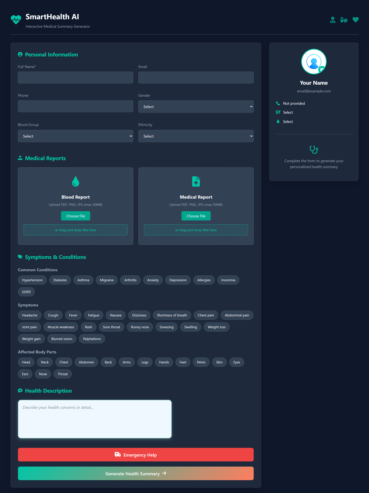
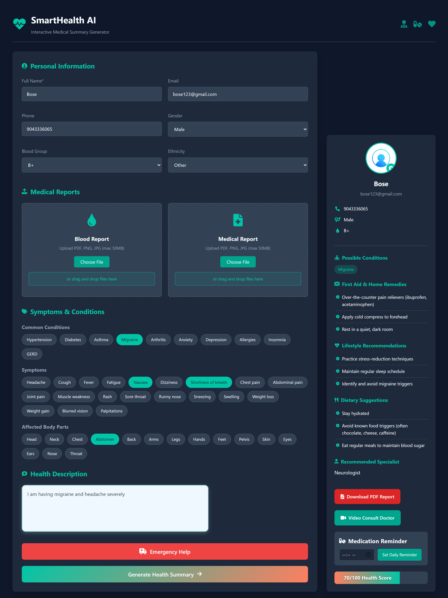
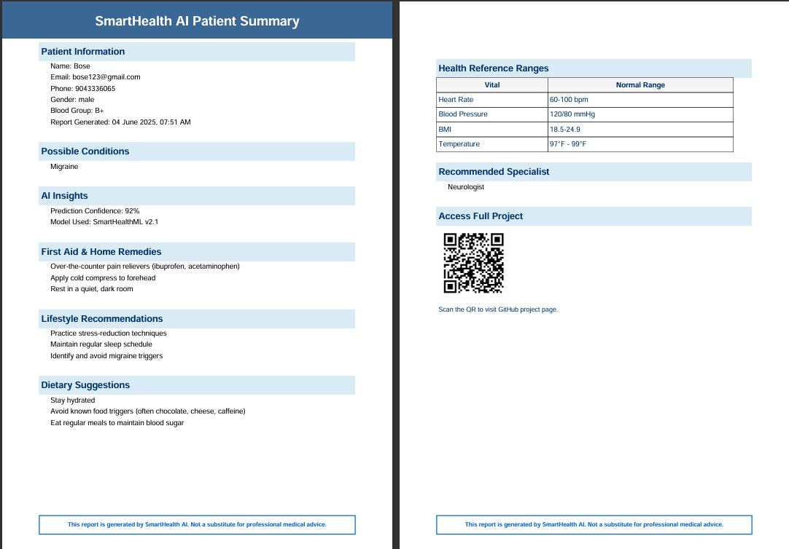

# 🧠 SmartHealth AI – Interactive Medical Summary Generator

An intelligent web-based health assistant that analyzes user symptoms and uploaded medical reports to generate a personalized medical summary, including condition suggestions, lifestyle advice, and a downloadable PDF report.

**Built for aspiring healthcare technology and AI solutions.**

---

## 🚀 What It Can Do

- 🩺 Select symptoms & body parts with an intuitive UI  
- 📁 Upload PDFs, images, or even short medical clips  
- 🧠 Use built-in AI logic to detect possible conditions  
- 📊 Generate a health score with personalized suggestions  
- 🧾 Export your results as a clean, readable PDF summary  
- 💾 Save inputs in a local SQLite database  
- 🤖 (Optional) Test a basic ML model trained on synthetic data  
- ✅ Comes with unit tests to ensure backend stability  
  

---

## 📸 Screenshots

### 🏠 Home Page UI


### 🔍 Symptom Selector


### 🧾 PDF Summary Report


> _Mock UI: Includes file uploads, symptom selectors, PDF download, and AI-powered insights._

---

## 🛠 Tech Stack

| Frontend       | Backend       | AI & OCR                | PDF    | Storage |
|----------------|----------------|--------------------------|--------|---------|
| HTML, CSS, JS  | Flask, Python | scikit-learn, Tesseract OCR | FPDF   | SQLite  |

---

## 📦 Installation

### 1. Clone the repository

```bash
git clone https://github.com/your-username/smarthealth-ai.git
cd smarthealth-ai
```

### 2. Create a virtual environment

```bash
python -m venv venv
venv\Scripts\activate  # On Windows
```

### 3. Install dependencies

```bash
pip install -r requirements.txt
```

> 🔍 Ensure [Tesseract OCR](https://github.com/tesseract-ocr/tesseract) is installed on your system.  
> On Windows, set the path in `app.py`:

```python
pytesseract.pytesseract.tesseract_cmd = r'C:\Program Files\Tesseract-OCR\tesseract.exe'
```

---

## ⚙️ Run the App

```bash
python app.py
```

Visit: [http://localhost:5050](http://localhost:5050)

---

## 🧪 Running Tests

```bash
python test_app.py
```

---

## 🧠 Using the ML Model

```bash
python ml_model.py
```

Modify test symptoms inside `ml_model.py`:

```python
test_input = ['cough', 'sore_throat']
```

---

## 💽 Data Storage

- User inputs saved in `health.db` (SQLite).
- View with:

```bash
sqlite3 health.db
sqlite> SELECT * FROM health_data;
```

---

## ✨ Portfolio Value

- Full-stack capability (frontend + backend + DB)  
- AI-driven decision logic  
- Clean data modeling with JSON  
- PDF report automation  
- Practical healthcare application  

---

## 📁 Project Structure

```
smarthealth-ai/
├── app.py                 # Main Flask backend
├── storage.py             # SQLite data storage logic
├── ml_model.py            # ML prediction script
├── test_app.py            # Unit tests
├── condition_mapping.json # Knowledge base
├── templates/
│   └── index.html         # Main UI
├── static/
│   ├── js/script.js       # Frontend logic
│   └── css/style.css      # Styling (if applicable)
├── project-snaps/         # Screenshot assets
├── health.db              # SQLite DB (auto-created)
└── README.md              # This file
```

---

## 📄 License

This project is for educational and demonstration purposes only.  
Not a substitute for professional medical advice.

---

## 🙌 Acknowledgments

- [Tesseract OCR](https://github.com/tesseract-ocr/tesseract)  
- [scikit-learn](https://scikit-learn.org/)  
- [FPDF for Python](https://pyfpdf.readthedocs.io/)  
- Font Awesome icons & UI inspiration  

---

## 💼 Author

**Arman Shaikh ** – _AI & Python Developer_

[LinkedIn](https://www.linkedin.com/in/armanshaikh2001/?trk=opento_sprofile_details) | [GitHub](https://github.com/armanshaikh-2001)
 | [Portfolio](https://yourportfolio.com)
